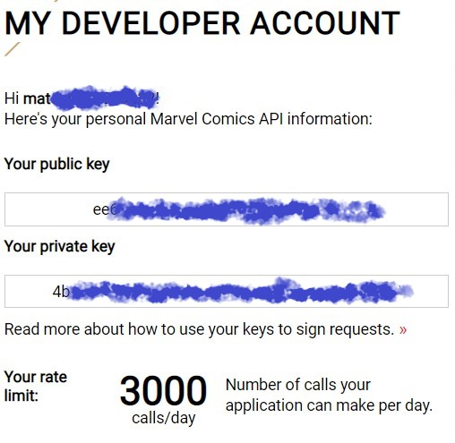

# AV2/AV3 - Desenvolvimento de Aplicações Web

<div align="center">
  <a href="https://www.unicarioca.edu.br/">
    
  </a>
</div>

## Centro Universitário Carioca - [UniCarioca](https://www.unicarioca.edu.br/)

### Informações Gerais:

Esta avaliação faz parte da disciplina "Desenvolvimento de Aplicações Web" ministrada pelo Mestre Antonio Felipe Podgorski realizada no 5º período do curso [Análise e Desenvolvimento de Sistemas](https://unicarioca.edu.br/cursos/graduacao/analise-e-desenvolvimento-de-sistemas) coordenado por André Sobral e Marcelo Perantoni no ano de 2022.

### Descrição da atividade:

<p align="center">Atividade Avaliativa</p>

O grupo deverá desenvolver um website utilizando React, através do [CodeSandBox](https://codesandbox.io/) e ao final disponibilizar o mesmo através de um arquivo PDF com o link da aplicação e o nome dos integrantes do grupo, que deverá ser postado no AVA.

Em relação ao website é esperado que alguns pontos sejam abordados, sendo estes:

- Utilizar React Router - https://reactrouter.com/
- Consumir uma API - https://github.com/public-apis/public-apis
- Context API
- Utilizar a Autenticação do Firebase
- Fazer o Uso do Firestore
- Estilizar com CSS

Cada uma das atividades implementadas irá valer até 1,0 ponto, podendo totalizar 6,0 pontos.
Cada grupo poderá ter até 06 integrantes.

### Integrantes do grupo:

Mateus Santos de Azevedo - 2020100086

---

## Tabela de Conteúdo

<ul>
  <li><a href="#-tecnologias">Tecnologias</a></li>
  <li><a href="#-estrutura-do-projeto">Estrutura do projeto</a></li>
  <li><a href="#-como-executar-o-projeto">Como executar o projeto?</a></li>
  <li><a href="#-como-contribuir">Como contribuir?</a></li>
</ul>

---

## 💻 Tecnologias

Esse projeto foi desenvolvido com as seguintes tecnologias:

- [Axios](https://axios-http.com/) para realizar requisições;
- [Firebase](https://firebase.google.com/) para armazenar os dados e realizar autenticação;
- [Bootstrap](https://getbootstrap.com/) para agilizar no estilo de alguns componentes;
- [Styled-Components](https://styled-components.com/) para estilização dos componentes e padronizar o projeto;
- [React Router](https://reactrouter.com/) para realizar as navegações e verificações de permissão de acesso;
- [Dotenv](https://create-react-app.dev/docs/adding-custom-environment-variables) para distribuir as credenciais secretas do projeto;

---

## 📋 Estrutura do projeto

Organizado por features

https://blog.matheuscastiglioni.com.br/como-organizar-projetos-em-react/

---

## 🤔 Como executar o projeto?

### Passo 1

- Configure o ambiente para executar a aplicação React neste link:
  [Como instalar o React.js](https://www.freecodecamp.org/portuguese/news/como-instalar-o-react-js-com-create-react-app/)

### Passo 2

- Clone o projeto para sua máquina local usando:
  `git clone https://github.com/mateus-azevedo/av2_desenv_web.git`

### Passo 3

- Crie um projeto Web no Firebase
  https://firebase.google.com/

- Copie as informações do objeto firebaseConfig
  - Estrutura do firebaseConfig
  ```js
  const firebaseConfig = {
    apiKey: "configuracaofirebase",
    authDomain: "configuracaofirebase",
    projectId: "configuracaofirebase",
    storageBucket: "configuracaofirebase.appspot.com",
    messagingSenderId: "configuracaofirebase",
    appId: "1:configuracaofirebase:web:configuracaofirebase",
  };
  ```
- Cole as informações entre aspas (") após o símbolo de igual (=) no arquivo `.env.example` no projeto
  https://github.com/mateus-azevedo/av2_desenv_web/blob/44e9fa1612ff96104d4d65a07033357d2d2275f2/.env.example#L7-L13

### Passo 4

- Crie uma conta no Portal do Desenvolvedor Marvel
  https://developer.marvel.com/

  Você receberá duas chaves:
  <div align="center">
    
  </div>

- Cole as chaves após o símbolo de igual (=) no arquivo `.env.example` no projeto
  https://github.com/mateus-azevedo/av2_desenv_web/blob/44e9fa1612ff96104d4d65a07033357d2d2275f2/.env.example#L1-L5

### Passo 5

- Renomeie o arquivo `.env.example` para `.env`
- Execute o comando `yarn` no terminal para atualizar as dependencias do projeto
- Execute o projeto com o comando `yarn start` no terminal

---

## 🤩 Como contribuir?

Após realizar a <a href="https://www.freecodecamp.org/portuguese/news/como-instalar-o-react-js-com-create-react-app/">configuração de ambiente React.JS</a> como citado anteriormente.
Faça:

### Passo 1

- O Fork deste projeto

### Passo 2

- Realize os passos <a href="#passo-3">3</a>, <a href="#passo-4">4</a>, <a href="#passo-5">5</a> do tópico "<a href="#-como-executar-o-projeto">🤔 Como executar o projeto?</a>"

### Passo 3

- Crie sua feature branch usando `git checkout -b username/my-feature` troque 'username' pelo seu nickname do GitHub e 'my-feature' pela alteração que você fará

### Passo 4

- As mensagens de commit deve seguir este padrão `git commit -m 'feat: My new feature'`

### Passo 5

- Após terminado suas modificações realize o push da sua branch com o comando `git push origin username/my-feature` (obs: deve ser o mesmo nome da branch local)

### Passo 6

- Crie um novo pull request

---
